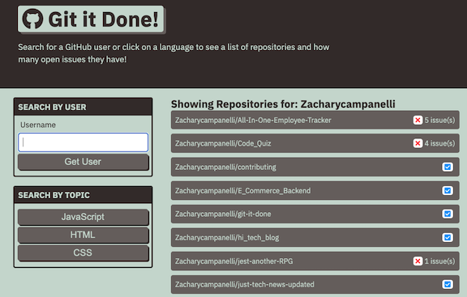
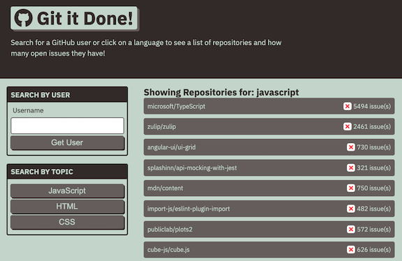
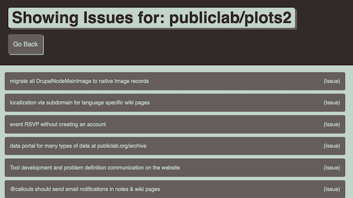

# Git-It-Done
  
## Description 

  
Git-It-Done is a web application that uses server-side APIs like the Github API and web-server APIs like the fetch api to create a webpage which allows the user to search for Github Repositories based on Username or Topic and returns both the Repository and the number of open issues it contains.

## Table of Contents
* [Installation](#Installation)
* [Usage](#Usage)
* [License](#License)
* [Questions](#Questions)

## Installation
Clone this repository to your local machine. Then all you have to do is open `index.html` and you will be taken to the home page for Git-It-Done

  
## Usage
Enter the name of a user you wish to search for in the search bar, or select among HTML, CSS, or JavaScript as a search topic to find repositories.

  

## License
A short and simple permissive license with conditions only requiring preservation of copyright and license notices. Licensed works, modifications, and larger works may be distributed under different terms and without source code.  

  
## Questions
If you have any questions, concerns, or comments, feel free to contact me:
  
-GitHub: [Zacharycampanelli](https://github.com/Zacharycampanelli)  
-Email: [zaccamp@optonline.net](mailto:zaccamp@optonline.net)
